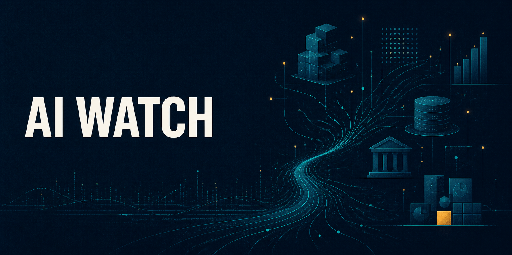

  

# AI Watch

AI Watch creates current, source-backed reports on important changes in AI. It covers model releases, compute, funding, applications, policy, and litigation. It separates company claims from outside evidence and explains the business effect in plain English.

## Use

Ask Codex to run `$ai-watch`. You can name a company, topic, country, or date range when you want narrower coverage.

The default run produces a weekly brief in the conversation and a polished one-page PDF. It includes the main development, supporting events, source links, and a short watch list.

## Install

Copy the [`ai-watch`](ai-watch) folder into your Codex skills directory. Keep the repository README and banner at the repository root.

## Contents

- [`SKILL.md`](ai-watch/SKILL.md) contains the research and writing workflow.
- [`ai-industry.md`](ai-watch/references/ai-industry.md) defines the sector map and source priorities.
- [`openai.yaml`](ai-watch/agents/openai.yaml) provides the Codex interface metadata.
